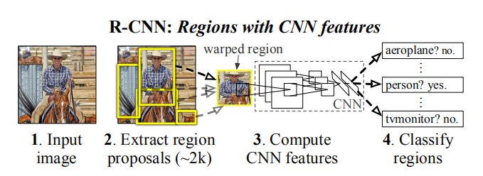

# R-CNN

文章[Rich feature hierarchies for accurate object detection and semantic segmentation](https://arxiv.org/abs/1311.2524)提出的算法`R-CNN`将`CNN`应用于目标检测领域，在当时取得了非常好的效果

## 工程流程

本文档实现了`R-CNN`算法进行目标检测的完整过程，包括

1. 数据集创建
2. 卷积神经网络训练
3. 分类器训练
4. 边界框回归器训练
5. 目标检测器实现

**本仓库最终实现一个汽车类别目标检测器**

## 模块构成

1. 区域建议生成：`selectivesearch`算法实现，生成类别独立的区域建议
2. 特征提取：卷积神经网络`AlexNet`实现，从每个区域建议中提取固定长度的特征向量
3. 线性`SVM`实现，输入特征向量，输出每类成绩
4. 使用类指定的边界框回归器计算候选建议的坐标偏移
5. 非最大抑制方法实现，得到最终的候选建议

*关于区域建议算法`selectivesearch`实现，在训练阶段使用高质量模式，在测试阶段使用快速模式*

## 相关链接

* [R-CNN](https://blog.zhujian.life/posts/5beb21d0.html)