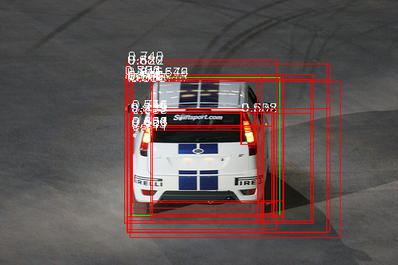
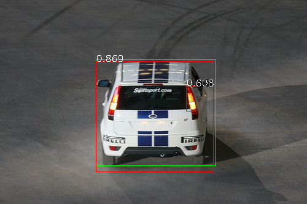

# 检测器实现

## 实现流程

目标检测的实现流程如下：

1. 输入图像
2. 使用选择性搜索算法计算得到候选建议
3. 逐个计算候选建议
      1. 使用`AlexNet`模型计算特征
      2. 使用线性`SVM`分类器计算得到分类结果
4. 对所有分类为汽车的候选建议执行非最大抑制

## python实现

* `detector_car.py`

## 非最大抑制

参考[[目标检测]Non-Maximum Suppression](https://blog.zhujian.life/posts/7b326d08.html)

## 实现参数

* 非最大抑制阈值：`0.3`
* 分类器阈值：`0.6`

## 实现结果

* 原图

* 没有分类器阈值以及非最大抑制

* 添加分类器阈值

* 添加非最大抑制

